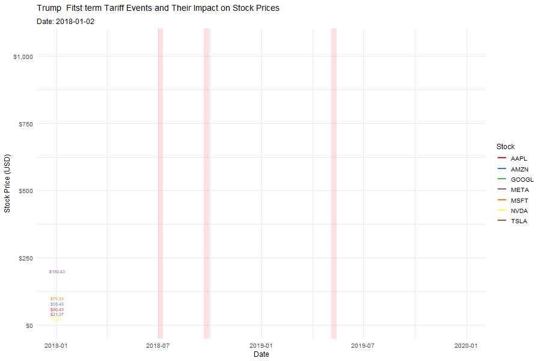

::: {.cell}

:::

::: {.cell}

:::

::: {.cell}

:::

U.S. tariffs on China from 2018 to 2025 have significantly affected domestic capital markets. Tariff announcements hit supply chain–dependent firms like Apple, Tesla, Amazon, and Nvidia the hardest. I gathered stock data using the quantmod package in R from Yahoo Finance, covering the Magnificent Seven tech stocks from 2018 to 2025..

## 🎥 Stock Price Animation with U.S. Tariff Events

